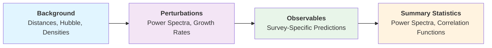

# Guide to cloelib's Architecture

This guide explains the modular architecture of **cloelib** and provides instructions for contributors to extend the library by adding new implementations of Perturbations and Observables.

## Overview

**cloelib** follows a layered architecture that separates cosmological calculations into distinct components:



Each layer depends on the previous one, creating a flexible pipeline from fundamental cosmology to final data products.

### Design Principles

`cloelib` embraces the following principles:

- **Modularity**: Each module owns one responsibility—Background handles cosmology, Perturbations handles structure growth, Observables handles survey specifics, and Summary Statistics handles final products. This keeps code maintainable, testable, and extensible. The architecture allows easy swapping of external code implementations (e.g., CAMB for CLASS)
- **Extensibility**: Uses [Python protocols (PEP 544)](https://typing.python.org/en/latest/spec/protocol.html) for type safety and flexibility—any class implementing required methods is valid, with no inheritance needed.
- **Flexibility**: Contributors can extend the library without modifying existing code by implementing classes that satisfy the required protocols—no need to touch cloelib source code.
- **Reproducibility**: Clear interfaces ensure consistent behavior across implementations, boosting the capacity of the user to reproduce results with other external codes.

## Core Components

### 1. [Background](background.md)

- **Purpose**: Compute background quantities as functions of redshift
- **Dependencies**: None (foundational layer)
- **Use case**: Implementing new Boltzmann solvers or emulators
- [Learn more about Background](background.md)

### 2. [Perturbations](perturbations.md)

- **Purpose**: Calculate perturbation theory quantities
- **Dependencies**: Background module
- **Use case**: Adding (non)-linear models or new structure formation codes
- [Learn more about Perturbations](perturbations.md)

### 3. [Observables](observables/index.md)

- **Purpose**: Compute survey-specific observables
- **Dependencies**: Perturbations (for tracers) or Background/Perturbations (for spectroscopic)
- **Use case**: Adding new measurement types or survey configurations
- [Learn more about Observables](observables/index.md)

### 4. [Summary Statistics](summary_statistics/index.md)

- **Purpose**: Compute final statistical quantities
- **Dependencies**: Observables module
- **Use case**: Implementing new statistical estimators
- [Learn more about Summary Statistics](summary_statistics/index.md)

## Typical Workflow

The standard workflow for computing observables follows this pattern:

```python
# 1. Initialize background cosmology
background = CAMBBackground(H0=67.5, Omega_b0=0.049, ...)

# 2. Initialize perturbations with background
perturbations = CAMBPerturbations(background=background, ...)

# 3. Define observables with perturbations or background
tracer = ShearTracer(perturbations=perturbations, dndz=..., z=..., ...)

# 4. Compute summary statistics
two_point = AngularTwoPoint(tracer1=tracer, tracer2=tracer)
C_ell = two_point.compute_Cl(ells=...)
```

## For Contributors

Each module page includes:

- Protocol definitions specifying required methods and properties
- Step-by-step guides for adding new implementations
- Code examples demonstrating proper usage
- Interface specifications for connecting with external codes
- Testing recommendations

The protocol-based design means contributors only need to implement the required methods without inheriting from base classes or understanding the entire codebase.

## Additional Resources

- [API Reference](../api.md): Detailed technical documentation
- [Contributing Guide](../contributing.md): General contribution guidelines
- [Playground Examples](https://github.com/cloe-org/playground): Usage demonstrations

## Support

For questions about the code structure or implementing new components:

- [GitHub Issues](https://github.com/cloe-org/cloelib/issues): Report bugs or request features
- [GitHub Discussions](https://github.com/cloe-org/cloelib/discussions): Ask questions and share ideas
- Tag `@cloe-maintainers` for assistance from the core team
